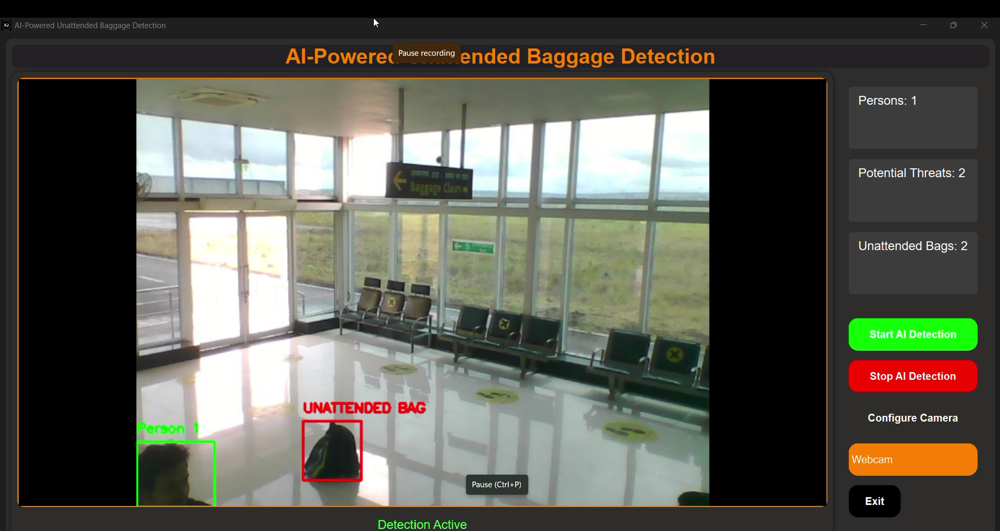

# AI-Powered Unattended Baggage Detection System 🛡️🎒

[](https://www.python.org/)
[](https://opensource.org/licenses/MIT)
[](https://github.com/ultralytics/yolov10)

A real-time surveillance system leveraging **YOLOv5** and **CNNs** to detect unattended baggage in high-security environments like airports. Developed in collaboration with the **Airport Authority of India (AAI)**.

  
*Figure 1: Real-time detection dashboard with threat metrics and controls*

  
*Figure 2: Alert for unattended baggage and user interaction prompts.*

---

## 🚨 Critical Notice  
**This system supplements — but does not replace — human security oversight.**  
Immediately report confirmed threats to airport authorities using designated protocols.

---

## 🏆 Key Features
- **Real-Time Detection**  
  🎯 YOLOv10-powered object detection (95.2% mAP)  
  🕒 Temporal analysis for abandoned baggage (5-minute threshold)
- **Automated Security Integration**  
  🔔 REST API alerts to CCTV control rooms  
  📡 WebSocket integration for live video feeds
- **Advanced Analytics**  
  📊 Crowd density heatmaps & threat probability scoring  
  📈 Historical incident logging with SQL/NoSQL support
- **Enterprise-Grade UI**  
  🖥️ Multi-camera grid view with ROI configuration  
  🛠️ Role-based access control (Admin/Operator/Auditor)

---

## 🧰 Technologies Used
| Category              | Tools/Frameworks                          |
|-----------------------|-------------------------------------------|
| **AI/ML**             | YOLOv5, TensorFlow, OpenCV, Scikit-learn  |
| **Backend**           | FastAPI, Redis, PostgreSQL, RabbitMQ     |
| **DevOps**            | Docker, Kubernetes, GitHub Actions       |
| **Monitoring**        | Grafana, Prometheus, Elastic Stack       |
| **Hardware**          | NVIDIA Jetson, Intel OpenVINO, ONNX Runtime |

---

## 📦 Installation

### Prerequisites
- NVIDIA GPU with CUDA 11.2+
- Python 3.8+
- Airport CCTV network access (RTSP/ONVIF)

1. **Clone with submodules**:
```bash
git clone --recurse-submodules https://github.com/SahilPatil-codes/Unattended-Baggage-Detection.git
cd Unattended-Baggage-Detection
