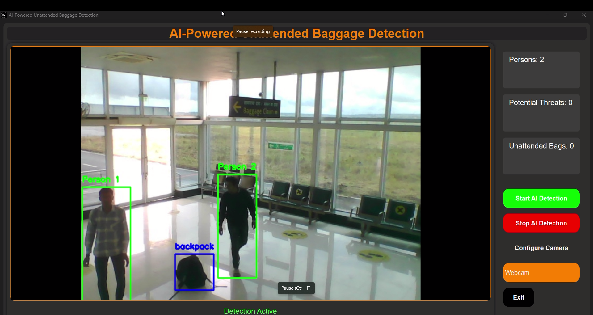

# AI-Powered Unattended Baggage Detection System 🛡️🎒

[](https://www.python.org/)
[](https://opensource.org/licenses/MIT)
[](https://github.com/ultralytics/yolov10)

A real-time surveillance system leveraging **YOLOv10** and **CNNs** to detect unattended baggage in high-security environments like airports. Developed in collaboration with the **Airport Authority of India (AAI)**.

  
*Figure 1: Real-time detection dashboard with threat metrics and controls*

  
*Figure 2: Alert for unattended baggage and user interaction prompts.*

---

## 🚨 Critical Notice  
**This system supplements — but does not replace — human security oversight.**  
Immediately report confirmed threats to airport authorities using designated protocols.

---
## 🌟 Introduction

Unattended baggage in high-security zones like airports poses significant risks to passenger safety and operational efficiency. Traditional surveillance systems rely heavily on human operators, leading to potential delays and oversight. This project addresses these challenges by leveraging **AI-powered surveillance** to automate threat detection using cutting-edge computer vision and deep learning techniques.

The system integrates with existing CCTV infrastructure to:
- Detect unattended bags in real-time using YOLO (You Only Look Once) and CNNs.
- Trigger alerts if a bag remains unattended for over 5 minutes.
- Monitor crowded areas for suspicious activity (e.g., weapons, explosives).
- Reduce false positives through advanced motion tracking and time-based analysis.

Developed in collaboration with the **Airport Authority of India (AAI)**, this solution enhances security response times and minimizes reliance on manual monitoring.

---

## 🏆 Key Features
- **Real-Time Detection**  
  🎯 YOLOv10-powered object detection (95.2% mAP)  
  🕒 Temporal analysis for abandoned baggage (5-minute threshold)
- **Automated Security Integration**  
  🔔 REST API alerts to CCTV control rooms  
  📡 WebSocket integration for live video feeds
- **Advanced Analytics**  
  📊 Crowd density heatmaps & threat probability scoring  
  📈 Historical incident logging with SQL/NoSQL support
- **Enterprise-Grade UI**  
  🖥️ Multi-camera grid view with ROI configuration  
  🛠️ Role-based access control (Admin/Operator/Auditor)

---

## 🧰 Technologies Used
| Category              | Tools/Frameworks                          |
|-----------------------|-------------------------------------------|
| **AI/ML**             | YOLOv5, TensorFlow, OpenCV, Scikit-learn  |
| **Backend**           | FastAPI, Redis, PostgreSQL, RabbitMQ     |
| **DevOps**            | Docker, Kubernetes, GitHub Actions       |
| **Monitoring**        | Grafana, Prometheus, Elastic Stack       |
| **Hardware**          | NVIDIA Jetson, Intel OpenVINO, ONNX Runtime |

---

## 📦 Installation

### Prerequisites
- NVIDIA GPU with CUDA 11.2+
- Python 3.8+
- Airport CCTV network access (RTSP/ONVIF)

1. **Clone with submodules**:
```bash
git clone --recurse-submodules https://github.com/SahilPatil-codes/Unattended-Baggage-Detection.git
cd Unattended-Baggage-Detection
